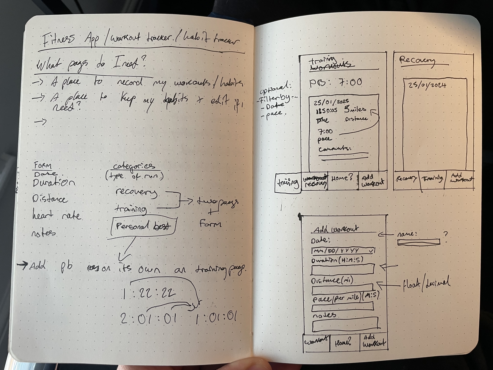
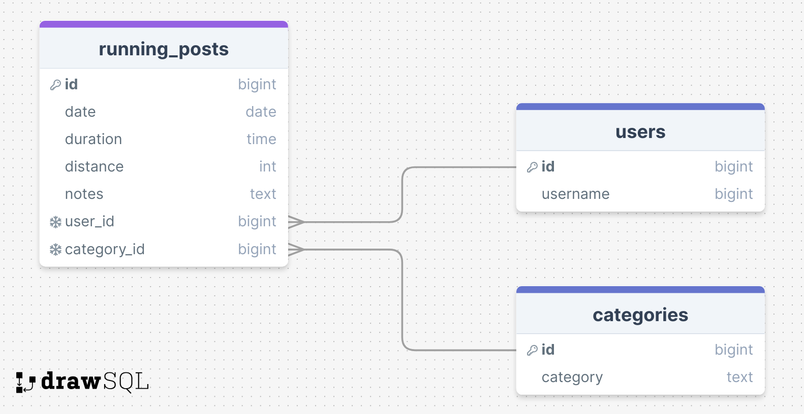
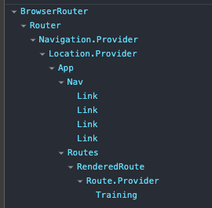

## Client and Server Links

Client: https://react-full-stack-app.onrender.com/
Server: https://react-full-stack-app-server.onrender.com

## User Stories

- 🐿️ As a user, I want to be able to create new posts and add them to the page
- 🐿️ As a user, I want to be able to assign a category to each post
- 🐿️ As a user, I want to be able to view all posts added on the page and the category they're in

## Stetch User Stories

- 🐿️ As a user, I want to be able to view all posts in a specific category by visiting a dedicated page for that category (Stretch Goal)
- 🐿️ As a user, I want to be able to update or delete my posts (Stretch Goal)

## Wireframes

## SQL Tables

## Component Tree

# Reflections

## Required

🎯 Please mention the requirements you met and which goals you achieved for this assignment.

- Design a database schema with relationships between tables
- Create a new application with a React client and an Express server
  (again, remember the client and the server should be separate)
- Seed the database with data. Either run your SQL queries in Supabase SQL Editor OR use a seed.js file. (if you use the Supabase editor, save the scripts you run in a file in your project, in case you need to rerun them, or we need to duplicate the project)
- Create Express endpoints to handle requests so you can POST and GET the data appropriately for your application.
- Create multiple pages using react-router-dom
- Create a home page.
- Create a page to show all the posts and use fetch to call your server to get your data.
- Create a page where users can create new posts using a form.
- Allow users to DELETE posts
- Allow users to filter posts in a specific category. Use either a query string like /posts?category=education or a dedicated route for the categories at /posts/:categoryName.

🎯 Were there any requirements or goals that you were not quite able to achieve?
🏹 Allow users to "Like" posts and increase the likes

🎯 If so, could you please tell us what was it that you found difficult about these tasks?

- This did'nt really suit the needs of my app

## Optional

🏹 Feel free to add any other reflections you would like to share about your submission e.g.

What went really well and what could have gone better?

- I decided not to use conditional rendering on click as I felt the user would prefer to see all the data at a glance.
- So the user can see their personal best as a motivator, I created a SELECT query to show the MIN amount of pace, this updates to always show the users personal best time.
- During this assignment, Time was a challenge, I had to use RegEx to enforce the user to use certain inputs. I also had to use to_char queries to show the date in a particular format.

## Attributions

- Theo, Richard, Manny & Alex for discussions and debugging together.
